# Metaplastic-BC_PXD014414

### Re-analysis of metaplastic breast cancer 27-sample TMT data from [PXD014414](https://www.ebi.ac.uk/pride/archive/projects/PXD014414).

#### Re-analysis by Phil Wilmarth   OHSU PSR core   April 27, 2020

##### The data is from [this publication](https://www.nature.com/articles/s41467-020-15283-z):

Djomehri, S.I., Gonzalez, M.E., da Veiga Leprevost, F., Tekula, S.R., Chang, H.Y., White, M.J., Cimino-Mathews, A., Burman, B., Basrur, V., Argani, P. and Nesvizhskii, A.I., 2020. Quantitative proteomic landscape of metaplastic breast carcinoma pathological subtypes and their relationship to triple-negative tumors. Nature communications, 11(1), pp.1-15.

## Data overview and summary of published analysis

From the Project description at [PXD014414](https://www.ebi.ac.uk/pride/archive/projects/PXD014414):

> Metaplastic breast carcinoma (MBC) is the most aggressive form of triple-negative cancer (TNBC), defined by the presence of “metaplastic” components of spindle, squamous, or sarcomatoid histology. The protein profiles underpinning the pathological subtypes and metastatic behavior of MBC are unknown. Using multiplex quantitative tandem mass tag-based proteomics we quantified 5,798 proteins in MBC, TNBC, and normal breast from 27 patients.

This is a re-analysis of the human tissue samples from the above publication where 27 samples were labeled with 10-plex TMT reagents and the data acquired on a Thermo Fusion Tribrid instrument using the newer SPS MS3 methodology. The samples were distributed across three plexes linked by a single pooled reference channel. Each set of biological samples (each plex) was separated into 8 high pH reverse phase fractions to enable deep proteome expression profiling.

The publication used the philosopher software suite developed in Alexey Nesvizhskii's lab at the University of Michigan (https://github.com/Nesvilab/philosopher) for the TMT expression analysis. Some of the analysis details are as follows: a larger human protein database from UniProt (with contams and decoys); [MSFragger](https://www.nature.com/articles/nmeth.4256) search engine, 20 ppm parent ion mass tolerance; TMT tags, cys alkylation, met oxidation modifications (some static, some dynamic); and trypsin with up to 2 missed cleavages. PSMs were filtered to 1% FDR using philosopher, proteins inferred with basic parsimony, and proteins filtered to 1% FDR. Reporter ion signals for "usable" peptides were aggregated into protein level measures. A ratio-based analysis was performed where each biological sample's proteins were expressed as ratios to the pooled reference channel.

## Re-analysis overview

The RAW files were downloaded from [PXD014414](https://www.ebi.ac.uk/pride/archive/projects/PXD014414) and processed with the [PAW pipeline](https://github.com/pwilmart/PAW_pipeline). The RAW files were converted into MS2 format files and reporter ions extracted using [MSConvert](http://proteowizard.sourceforge.net/) and Python scripts. [Comet](http://comet-ms.sourceforge.net/) was used for PSM assignments. Search parameter highlights were: a canonical UniProt reference protein database (with contams and decoys), tryptic cleavage with up to 2 missed cleavages, 1.25 Da monoisotopic parent ion mass tolerance, 1.0005 Da monoisotopic fragment ion mass tolerance, static cys alkylation and TMT tags, and variable met oxidation.

Accurate mass conditional discriminant score histograms and the target/decoy method were used to control PSM FDR at 1%. Basic and extended parsimony analysis was used to infer proteins. Protein FDR was controlled using the two-peptide rule. Individual reporter ion peak heights (intensities) were aggregated into total protein intensities for each biological replicate.

The data from each of the three plexes were put onto a common, matched intensity scale using the pooled reference channels and the [internal reference scaling](https://pwilmart.github.io/TMT_analysis_examples/IRS_validation.html) (IRS) method. The IRS method naturally excludes the very low abundance proteins that account for almost all of the missing data. This approach does not need any special methods for handling missing data, *per se*. The final data is retained in its natural intensity space and avoids all the limitations of ratio-based methods. This has the benefit of providing a realistic relative protein abundance ranking dimension (the summed intensity). This can be helpful for data interpretation.

## Statistical analyses

Generating high quality **starting data** for biological exploration is the real focus of the PAW pipeline. Demonstrating the utility of the data the PAW pipeline produces; however, requires some statistical analysis. [Jupyter notebooks](https://jupyter.org) using an R kernel were used to explore the data normalization concepts and summarize the underlying data quality. The final results tables from the PAW pipeline bear strong resemblance to count tables from next gen sequencing. They are, therefore, compatible with widely used genomic statistical packages such as [edgeR](https://bioconductor.org/packages/release/bioc/html/edgeR.html).

The 27 samples had 6 normal tissue samples, 6 non-metaplastic triple negative breast cancer tissue samples, and 15 metaplastic breast cancer tissue samples. The metaplastic samples were classified into several subtypes. There were three major subtypes: chondroid, spindle, and squamous. One of the chondroid samples was actually a normal tissue sample and was reassigned. Two Jupyter notebooks were constructed to look at two questions: (1) how do the major tissue types (normal, triple negative, and metaplastic) differ? and (2) how do the metaplastic subtypes differ? The `PXD014414_comparisons_major.ipynb` or `PXD014414_comparisons_subtypes.ipynb` notebook files can be selected to display the notebooks at directly at GitHub. The notebooks are also saved as HTML files in case the repository is downloaded as a Zip file.

---

## PAW pipeline filtering overview

There were 754,130 total MS2 scans acquired from the 24 RAW files. The mass and score cutoffs used to achieve the 1% PSM FDR are illustrated below.

### Delta-mass histograms are considered first:

The PAW pipeline uses wider parent ion tolerances in Comet (typically 1.25 Da) for two reasons: (1) accurate mass does not distinguish correct and incorrect matches unless incorrect masses are allowed to have inaccurate masses, and (2) Comet scores are converted to [PeptideProphet-like](https://pubs.acs.org/doi/abs/10.1021/ac025747h) discriminant scores. The second reason needs a reliable DeltaCN score, which requires a large number of theoretical peptides be scored in the search. That is guaranteed in a wider tolerance search.

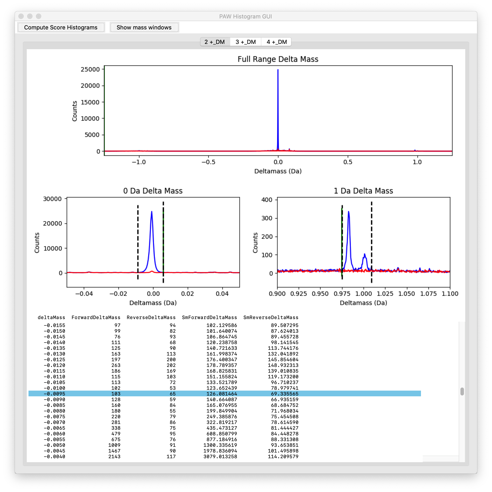

These are the delta-mass histograms for the 2+ peptide top hits. The top panel shows the wide tolerance search full range (+/- 1.25 Da). Matches to the forward protein sequences are in blue. Matches to the sequence-reversed decoys are in red. We have (as expected) a major peak at 0.0 Da. We also have very small peaks at 0.984 Da (deamidation) and 1.003 Da (an isotopic peak mis-trigger). The lower two panels are expanded scale plots of these two regions. The dotted lines define adjustable windows to capture the peak(s) in each region. The windows will be called the 0-Da (left) and 1-Da (right) regions.

The incorrect scores (in red) are uniformly distributed across the +/- 1.25 Da delta-mass space, as are the incorrect matches to the target sequences (there are also flat distributions in the blue histograms). We will also make score histograms for the delta-mass values that were not inside either the 0-Da region or the 1-Da region. The instruments may not be able to measure an accurate mass for all of the very low abundance peptides.

---

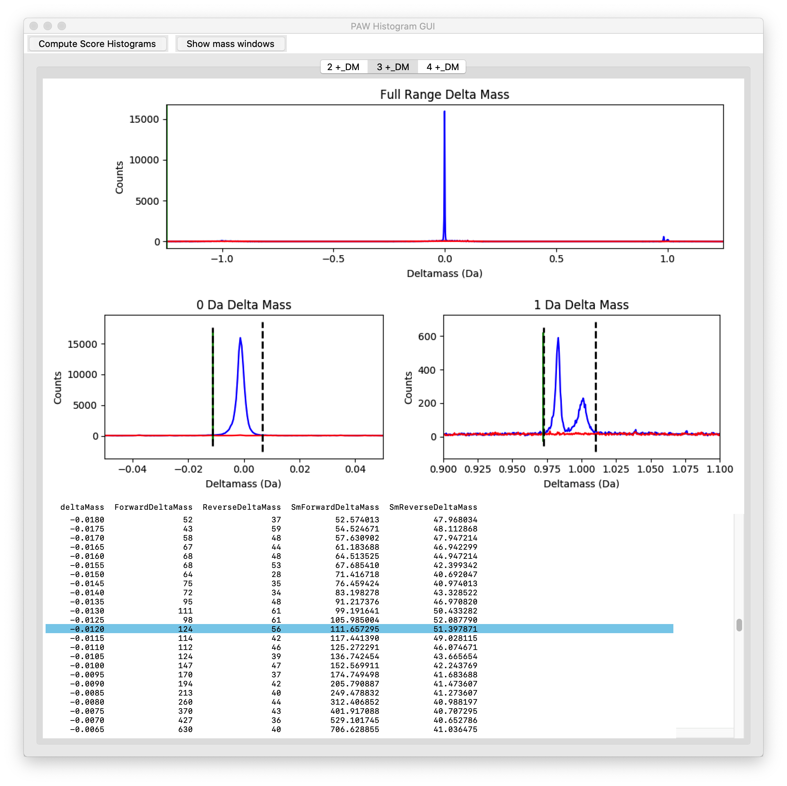

These are the delta-mass histograms for the 3+ peptide top hits. The 0-Da peak is slightly wider and about half as tall as the 2+ peptides. The peaks in the 1-Da region are relatively larger. 3+ peptide tend to be longer so they are more likely to contain an asparagine residue (the source of the deamidations). 3+ peptide will also tend to be heavier with a less prominent monoisotopic peak, so mis-triggering on the first isotopic peak is more likely.

---

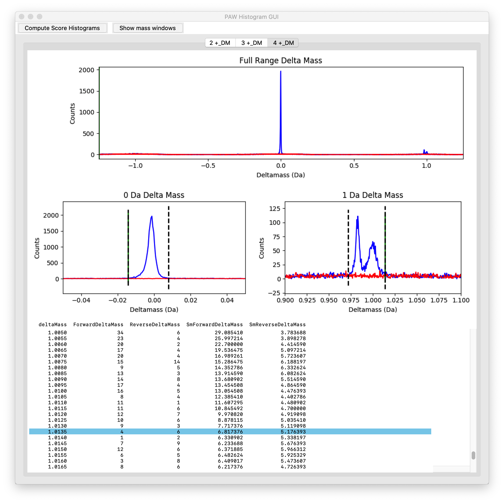

These are the delta-mass histograms for the 4+ peptide top hits. We have far fewer 4+ peptides with trypsin compared to 2+ and 3+ peptides. The 0-Da peak gets wider with increasing charge state, and the relative chance of mis-triggers gets greater.

---

### Conditional score histograms are checked next:

The PAW pipeline takes a divide and conquer approach to controlling PSM FDR. We have three charge states (2+, 3+, and 4+) in three delta-mass regions (0-Da, 1-Da, and outside windows) for 9 sets of conditional score histograms. Matches are further divided into unmodified peptides and each modification grouped by mass shift. We only specified oxidized methionine in the Comet searches, so we have one +16 mass shift. There are some samples (serum, saliva, etc.) where semi-trpytic peptides are common. Semi-trpytic searches are supported by separating matches by number of tryptic termini (NTT). We required fully-tryptic specificity, so all of the NTT=1 histograms will be empty.

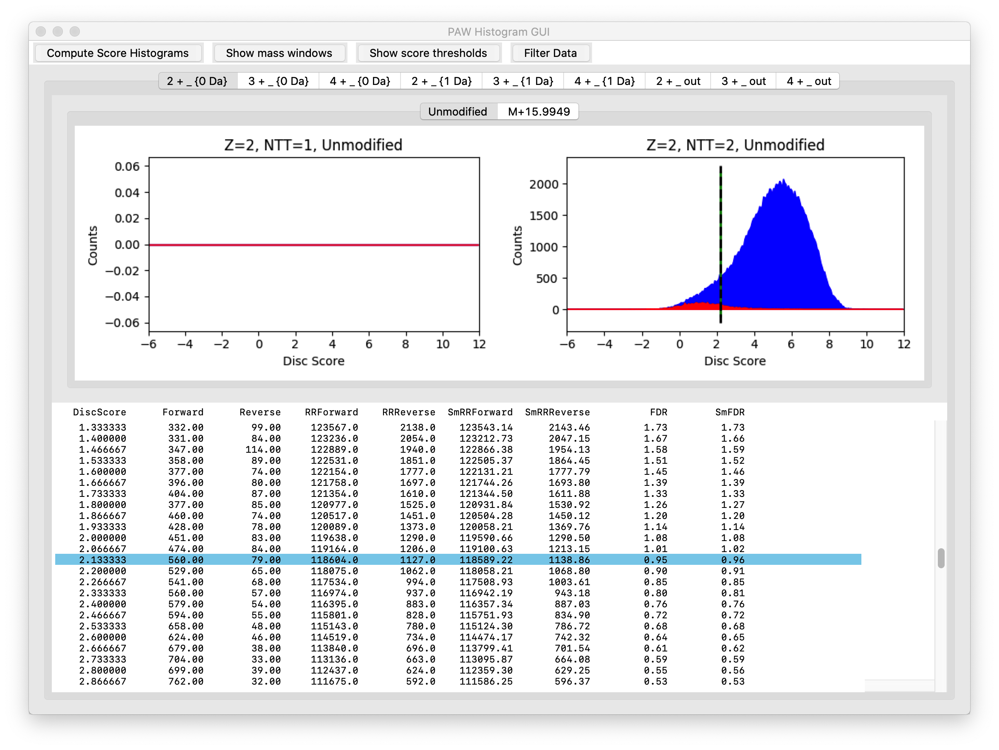
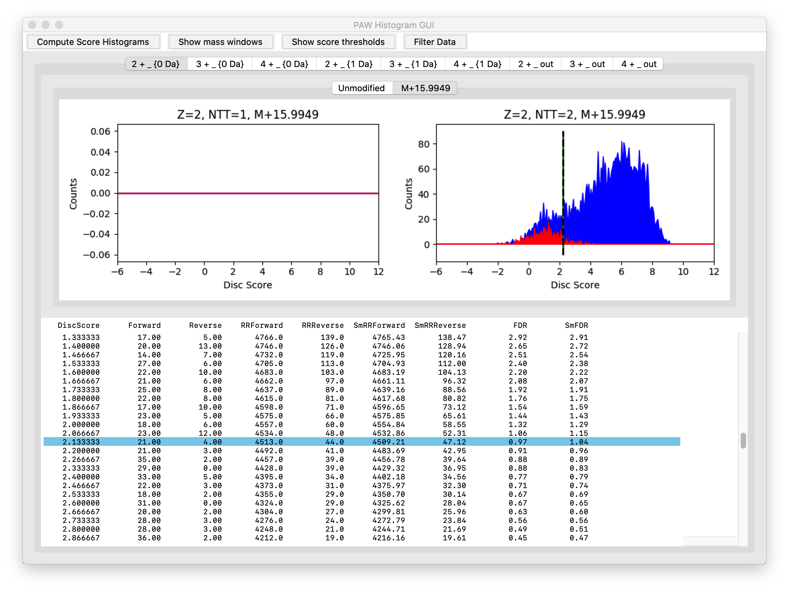

These are the scores for 2+ matches that had delta masses inside the 0-Da window. The unmodified peptides are in the top figure and the oxidized methionine peptides are in the lower figure. The target matches are in blue and the decoy matches are in red. The numerical tables below the histograms show the PSM FDR for the selected histogram at the location of the dotted line (the highlighted row). The dotted line in the right histogram corresponds to the 1% FDR cutoff. The majority of the correct target matches will be retained (to the right of the dotted line).

> The thresholds for a 1% FDR are set automatically by the GUI, but they can be changed interactively.

---

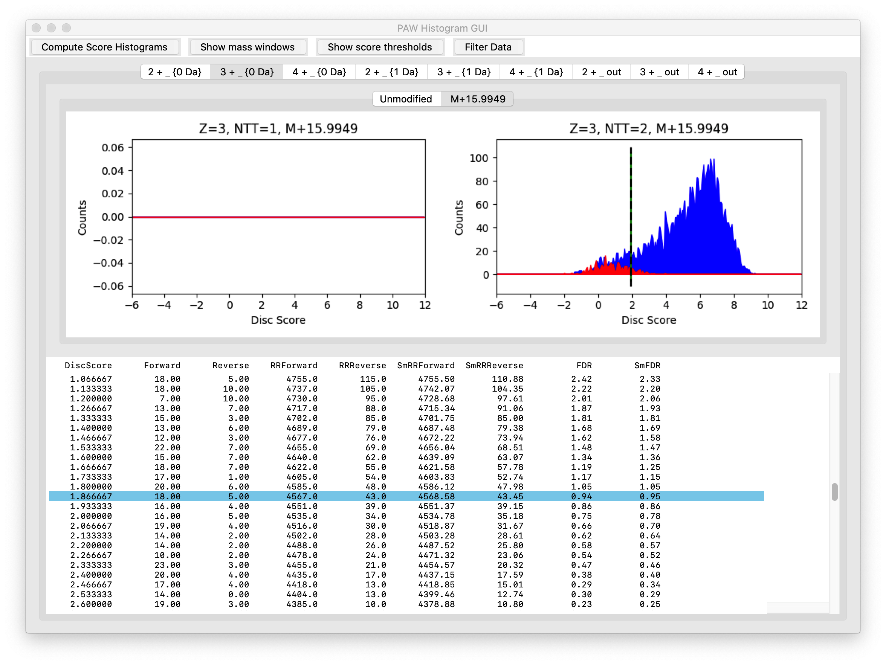

These are the similar score histograms for the 3+ peptides inside the 0-Da window.

---

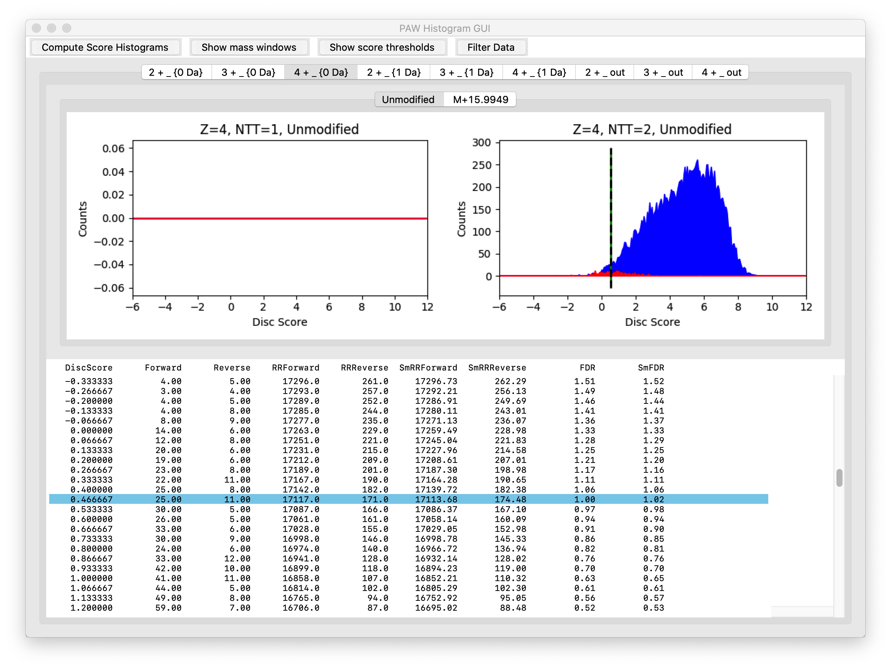
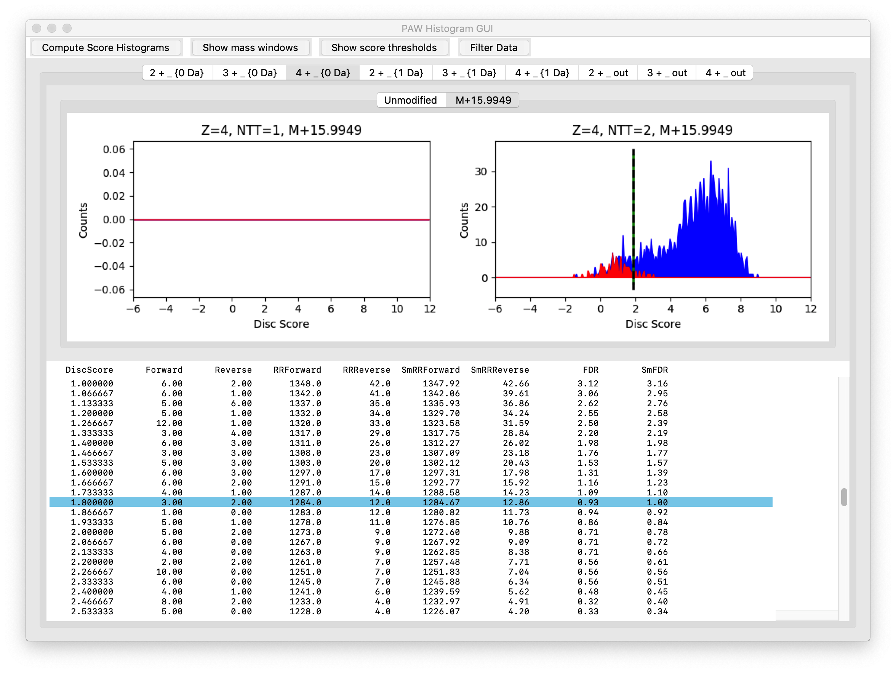

Finally, here are the 4+ peptide scores for the 0-Da window. We have a lot fewer 4+ peptides.

---

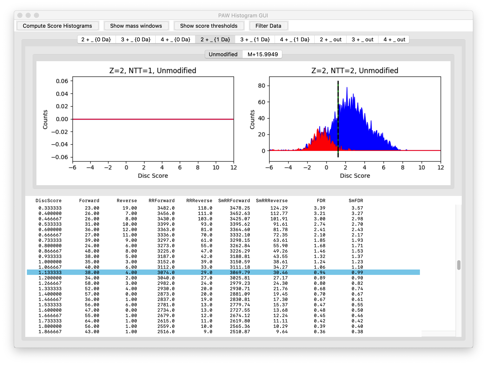
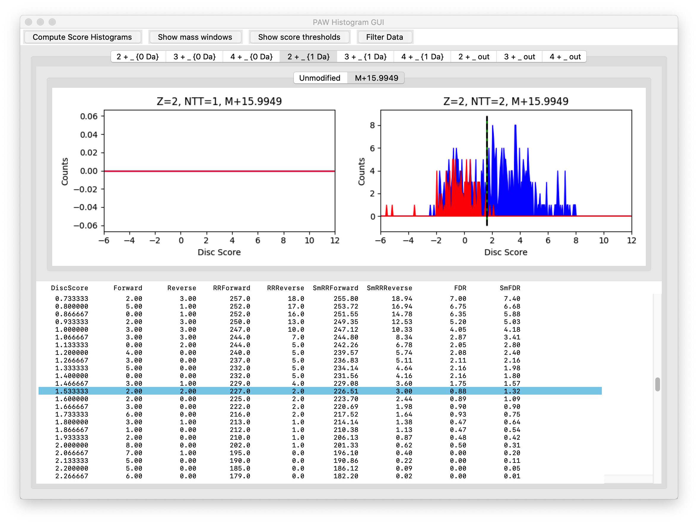

We have relatively few correct target matches for peptides in the 1-Da regions. We simplify things a little by combining deamidated peptides (note that we did not specify deamidation as a variable modification) and C13 mis-triggers into a single score histogram. We have a difference in the relative magnitudes of the target matches (in blue) and the decoy matches (in red) compared to the 0-Da regions. We will need to set slightly higher score cutoffs to maintain the 1% FDR. Only the 2+ peptides are shown for the 1-Da regions. The 3+ and 4+ peptides are similar.

---

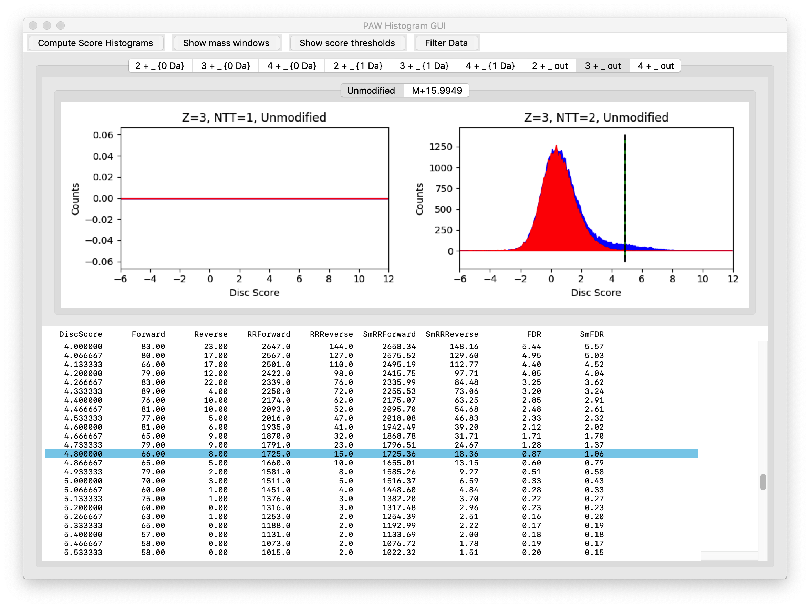
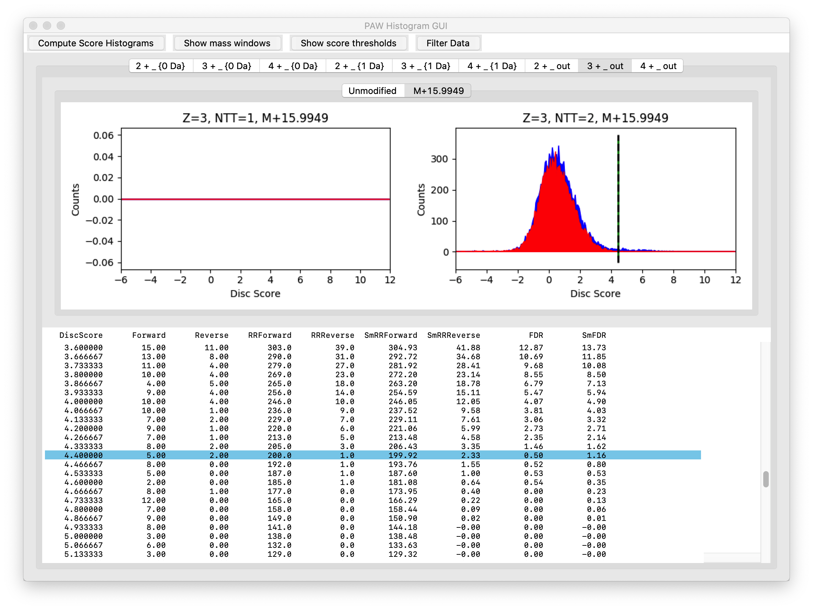

Last, but not least, are the matches that did not have defined delta masses (outside of the 0-Da or the 1-Da windows). It was not obvious in the delta-mass histograms above that there was any excess of target matches compared to decoy matches outside of the 0-Da or 1-Da regions. However, we see that there are clearly high-scoring target matches that can be recovered. The sensitivity to recover these peptides is not great, but every little bit helps. Only the 3+ peptides are shown for the "outside" matches. The 2+ and 4+ peptides are similar.

---

There were 266,723 scans that passed the filtering thresholds. The publication reported 251,305 "peptides" (probably PSMs). The PAW processing had about 6% more identified PSMs. Further comparisons break down due to different protein inference choices. The PAW protein numbers were 5,330 after basic parsimony steps at 2 peptides/protein/plex. The publication reported 5,798 proteins, but likely included single peptide per protein identifications.

The publication's TMT integrator processing yielded 5,635 quantifiable proteins; however, there was considerable missing data that required imputation with their approach. The IRS method restricts the quantifiable proteins to those seen in each plex, and that was 4,132 proteins for the PAW analysis. Those proteins (81% of the total number) account for 99.55% of the total intensities. Those 4,132 proteins only have 0.2% missing values. The 955 proteins not seen in all plexes (0.45% of the total intensity) have 98% of all the missing data points.

---

### File roadmap

- `A_peptide_results_9.txt`: Detailed PSM-level report for plex A
- `add_TMT_intensities_log.txt`: Log file from adding reporter ion intensities to results files
- `analysis_stats.xlsx`: Some PAW pipeline statsitics
- `B_peptide_results_9.tx`t: Detailed PSM-level report for plex B
- `C_peptide_results_9.txt`: Detailed PSM-level report for plex C
- `comet.params`: Comet parameters file
- `file_list.txt`: This file
- `GOTerms_report.txt`: Frequency summary of GO terms
- `grouped_peptide_summary_9.txt`: Peptide summary after extended parsimony grouping
- `grouped_peptide_summary_TMT_9.txt`: Peptide summary after extended parsimony grouping with reporter ion intensities
- `grouped_protein_summary_9.txt`: Protein summary after extended parsimony grouping
- `grouped_protein_summary_TMT_9.txt`: Protein summary after extended parsimony grouping with reporter ion intensities
- `keyword_report.txt`: Frequency summary of UniProt keyword terms
- `labeled_grouped_protein_summary_TMT_9.txt`: Protein summary after extended parsimony grouping with sample keys and additional contaminant flagging
- `labeled_grouped_protein_summary_TMT_9_IRS_normalized.txt`: Final IRS normalized protein table
- `pathway_report.txt`: Frequency summary of Reactome Pathway terms
- `PAW_IRS_log.txt`: Log file from the IRS normalization step
- `PAW_protein_grouper.log`: Log file from the exgtended parsimony grouping step
- `PAW_results.log`: Log file from the basic protein inference step
- `PAW_table_descriptions_9.txt`: Summary of the files and tables from the PAW pipeline
- `peptide_summary_9.txt`: Initial peptide summary
- `protein_summary_9.txt`: Initial protein summary table (this table is redundant - each protein in each group gets a row)
- `PXD014414_comparisons_major.html`: Notebook for comparisons of normal to triple negative to metaplastic samples in HTML format
- `PXD014414_comparisons_major.ipynb`: Notebook for comparisons of normal to triple negative to metaplastic samples (iPython notebook with an R kernel)
- `PXD014414_comparisons_major.r`: The R code cells from the notebook for comparisons of normal to triple negative to metaplastic samples
- `PXD014414_comparisons_subtypes.html`: Notebook for comparisons of metaplastic subtypes in HTML format
- `PXD014414_comparisons_subtypes.ipynb`: Notebook for comparisons of metaplastic subtypes (iPython notebook with an R kernel)
- `PXD014414_comparisons_subtypes.r`: The R code cells from the notebook for comparisons of metaplastic subtypes
- `PXD014414_labeled_grouped_protein_summary_TMT_9_IRS_normalized.xlsx`: Main IRS summary table in Excel with some formatting
- `PXD014414_MBC_three_subclasses_results.txt`: Output from the notebook comparing metaplastic subtypes
- `PXD014414_MBC_three_subclasses_results.xlsx`: Output from the notebook comparing metaplastic subtypes in Excel with formatting (DE candidates)
- `PXD014414_three_tissues_results.txt`: Output from the notebook comparing major tissue types
- `PXD014414_three_tissues_results.xlsx`: Output from the notebook comparing major tissue types in Excel with formatting (DE candidates)

---

Phil Wilmarth, OHSU   April 27, 2020
